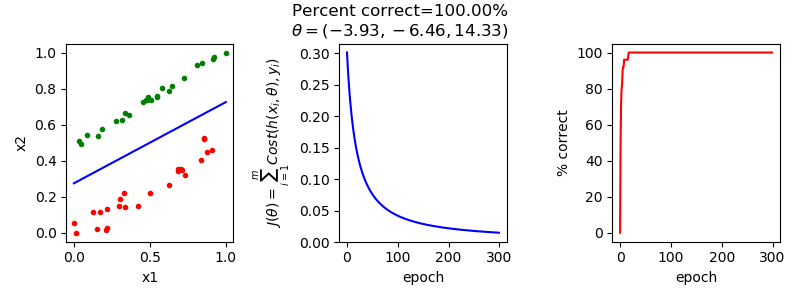
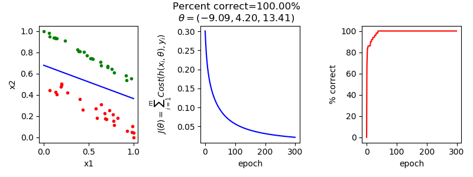

# python-logisticregression (work in progress)

# Description
In machine learning logistic regression is a statistical model that takes linear combination of real valued inputs,  and model parameters,  to produce a binary classification, i.e. assign a class label . The model, also referred to as the hypothesis  gives the probability an example  having . A value   can be classified using:

&space;>=&space;0.5\\&space;\\\\0&\text{otherwise}&space;\end{cases})

where 

&space;=&space;\frac{1}{1&plus;e^{-x_i\theta^T}})

The hypothesis function  is the linear combination of  and  used as the input to the sigmoid function:

&space;=&space;\frac{1}{1&plus;e^{-t}})

The sigmoid function has a smooth monotonically increasing value approaching 1 from 0, which makes it suitable for modelling a probability (in this case that the class label is 1, i.e. [P(y=1 \mid x; \theta)](https://latex.codecogs.com/gif.latex?P(y=1&space;\mid&space;x;&space;\theta))).


The goal of logistic regression is to find a theta which linearly separates the examples in the training set with the minimal amount of error. The error is modelled by a "cost" function that represents the difference between the labels from the training data set, and the classification of the training data given [h(x,\theta)](https://latex.codecogs.com/gif.latex?h(x_i,\theta)). Therefore the error function for the training set of m examples is:

&space;=&space;\frac{1}{m}\sum^{m}_{i=1}&space;Cost&space;(h(x_i,&space;\theta),&space;y_i))

One simple cost function is taking the sum of squared difference between y and [h(x_i,\theta)](https://latex.codecogs.com/gif.latex?h(x_i,\theta)) (the function used in least squares regression). It turns out is not that helpful as the the exponential terms in  mean that a cost function over theta would be non-convex (have many local minima). If the cost function is convex, it will have only a single minima, therefore it is easier to find the single minimum. The cost function used in logistic regression where h is the sigmoid function, is:

,y)&space;=&space;\begin{cases}&space;-log(h_\theta(x))&space;&&space;\text{if&space;}&space;y&space;=&space;1&space;\\\\&space;-log(1-h_\theta(x))&space;&&space;\text{if&space;}&space;y&space;=&space;0&space;\\&space;\end{cases})


# Resources
+ [Andrew Ng Lectures](https://www.youtube.com/watch?v=-la3q9d7AKQ)
+ [Washington CSS409 Lecture Notes](http://courses.washington.edu/css490/2012.Winter/lecture_slides/05b_logistic_regression.pdf)
+ [Rohan Kapur](https://ayearofai.com/rohan-1-when-would-i-even-use-a-quadratic-equation-in-the-real-world-13f379edab3b)
+ [Kaggle Wisconsin Data](https://www.kaggle.com/uciml/breast-cancer-wisconsin-data)

# Why not use SciPy?
The objective of this work is to build a pure python implementation for the purposes of learning, and helping others learn the logistic regression algorithm. Interested readers with only minimal python experience will be able to read, and step over this code without the added complexity of a library such as SciPy. It is not by any means intended for production use :)

# Running the code
## Dependencies
+ python 3.6.3
+ matplotlib 2.1.1 - see [here](https://matplotlib.org/users/installing.html) for installation instructions.

## Execution
Run the code with the python interpreter: 

```python logregression.py ./resources/<config.cfg>```

Where config.cfg is a plain text configuration file. The format of the config file is a python dict with the following fields:

```
{

   'data_file' : '\\resources\\2d_1.csv',
   'data_project_columns' : ['x1', 'x2'],
   'class_label_col' : ['y'],
   'class_label_mapping' : {1 : 1, 0 : 0},
   'data_prep_func' : 'unit_normalize',
   'learning_rate' : 0.025,
   'plot_func' : 'plot_simple_two_dimensional',
   'plot_config' : {'colors' : {1 : 'green', 0: 'red'},
                    'x-axis-att' : 'x1',
                    'y-axis-att' : 'x2',
                    'output_file_prefix' : '2d_1' }
 }
```

You have to specify:
 + a csv data file;
 + which columns of data to project;
 + which column specifies the class label;
 + how to map the class label to a the binary label {0,1};
 + learning rate, the adaptation speed of the batch gradient descent;
 + function that can plot data once logistic regression has been completed;
 + plot config depends on the plot func specified
 
# Results
## Basic 2D 1 and Basic 2D 2
I generated some simple two dimensional data that was linearly seperable (see 2d_1.config and 2d_2.config in the resources directory). The following two plots show:
 + in the left subplot the data where red/green are the data points of the two classes, the blue line is the linear seperation according to theta);
 + in the middle subplot the value of );
 + and in the right subplot the accuracy of [h(x_i,\theta)](https://latex.codecogs.com/gif.latex?h(x_i,\theta)) over the training set.




## Wisconsin Breast Cancer Data


# Extensions
+ Regularization;
+ Multi-class;
+ Non linear co-efficients;
 