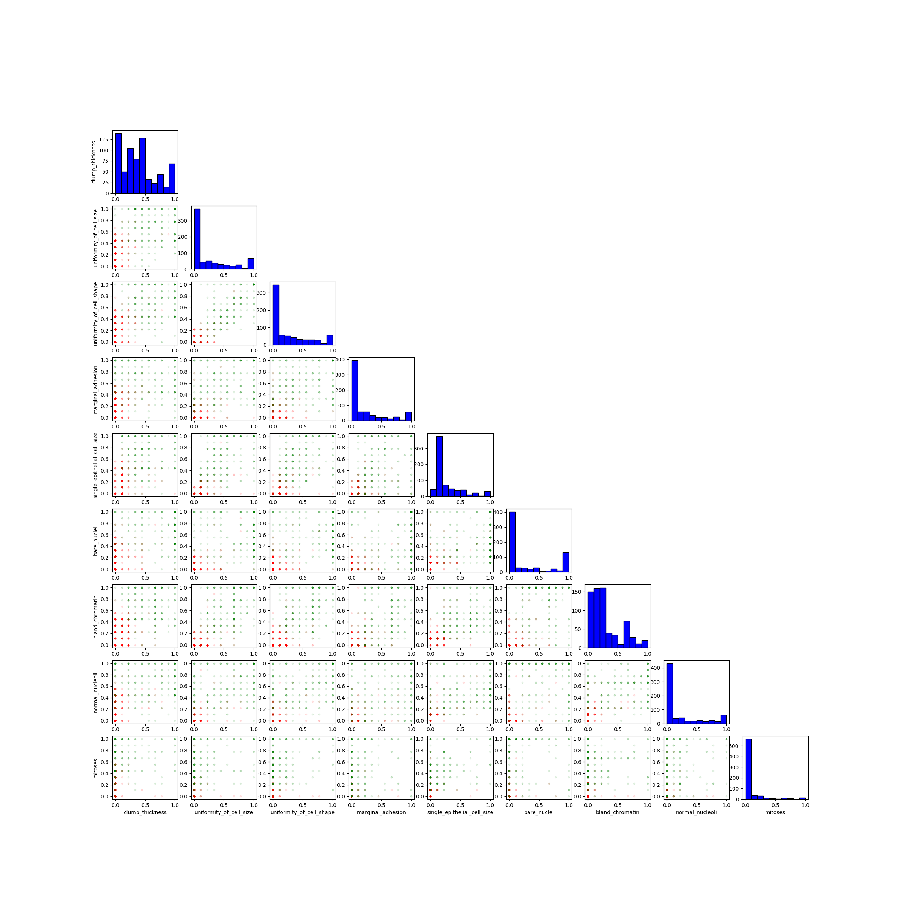

# python-logisticregression (work in progress)

# Description
In machine learning logistic regression is a statistical model that takes linear combination of real valued inputs,  and model parameters,  to produce a binary classification, i.e. assign a class label . The model, also referred to as the hypothesis  gives the probability an example  having . A value  can be classified using:

&space;>=&space;0.5\\&space;\\\\0&\text{otherwise}&space;\end{cases})

where 

&space;=&space;\frac{1}{1&plus;e^{-x_i\theta^T}})

The hypothesis function  is the linear combination of  and  used as the input to the sigmoid function:

&space;=&space;\frac{1}{1&plus;e^{-t}})

The sigmoid function has a smooth monotonically increasing value approaching 1 from 0, which makes it suitable for modelling a probability (in this case that the class label is 1, i.e. ).


The goal of logistic regression is to find a theta which classifies the examples in the training set with the minimal amount of error. The error is modelled by a "cost" function that represents the difference between the labels from the training data set, and the classification of the training data given ). The error function for the training set of m examples is:

&space;=&space;\frac{1}{m}\sum^{m}_{i=1}&space;Cost&space;(h(x_i,&space;\theta),&space;y_i))

One simple cost function is taking the sum of squared difference between y and ) (the function used in least squares regression). It turns out is not that helpful as the the exponential terms in  mean that a cost function would be non-convex (have many local minima). If the cost function is convex, it will have only a single minima meaning is amenable to gradient descent (i.e. not require meta-heuristics such as simulated annealing etc). The cost function used in logistic regression where h is the sigmoid function is:

,y)&space;=&space;\begin{cases}&space;-log(h_\theta(x_i,\theta))&space;&&space;\text{if&space;}y&space;=&space;1&space;\\\\&space;-log(1-h_\theta(x_i,\theta))&space;&&space;\text{if&space;}&space;y&space;=&space;0&space;&space;\end{cases})

When you take the partial derivative of the cost function with respect to  (a bit beyond my calculus), you get an update function which is amenable to gradient descent i.e. allows you to "walk down" the gradient of the convex cost function to find the minima. The update function for each dimension of the data j is:

&space;-&space;y_i)x_i^j)

The  term is a learning rate and determines the "step-size", i.e. how quickly the algorithm moves down the gradient. In languages that support vectorization all j elements of theta may be updated in a single operation. This gradient descent process is repeated either a fixed number of times, or according to some other termination criteria e.g. accuracy achieved, or limited  improvement in consecutive iterations. This update function is considered a "batch" optimization as the full set of training updates is evaluated for a single update to , i.e.  operations are required to compute the sum for a step down the gradient of the cost function. Other update functions use less updates, play tricks with the size of  etc, one common is [stochastic gradient descent](https://en.wikipedia.org/wiki/Stochastic_gradient_descent).

The final value of   can be used to evaluate how well the classifier works with the training set. A classifier may be more thoroughly evaluated using [cross validation](https://en.wikipedia.org/wiki/Cross-validation_(statistics)), different subsets of the universal data set are used as the training set, and test test. 

## Implementation Notes
It is common practice to normalize the data before running the logistic regression, and other ML algorithms. This allows each attribute to be plotted on the same axis, whether it be a scatter plot, or a histogram. It also has one additional benefit in that it seems to limit the likelihood of having overflow errors when the dot product of  and  are large. The limits will vary  across computing platforms (languages etc), and data sets, however fixed precision will mean there are values that cause overflow/underflow in the logit function. For example, without normalization the Wisconsin breast cancer data will overflow when theta = (-10.25, 171.78, -57.99, -57.60, -22.20, 0, 0, 0, 0, 0), and x_i = (1, 1.0, 6.0, 8.0, 10.0, 8.0, 10.0, 5.0, 7.0, 1.0) on my platform (Python 3.6.2 v3.6.2:5fd33b5 32 bit Intel on win32). There are some improvements that can be made to make this code more robust, such as those outlined [here](https://stackoverflow.com/questions/37074566/logistic-sigmoid-function-implementation-numerical-precision). However normalizing the wisconsin data on my platform was sufficient to avoid overflow in the logistic function.
```python
def logistic(x):
    logit = 1 / (1 + math.exp(-x))
    if 1.0 == logit:
        return logit - sys.float_info.epsilon
    if 0.0 == logit:
        return sys.float_info.epsilon
    return logit

1/(1+math.exp(709.77))
5.633853888082006e-309
1/(1+math.exp(709.78))
5.577796105262746e-309
1/(1+math.exp(709.79))
Traceback (most recent call last):
  File "C:\Program Files\JetBrains\PyCharm Community Edition 2017.2.3\helpers\pydev\_pydevd_bundle\pydevd_exec2.py", line 3, in Exec
    exec(exp, global_vars, local_vars)
  File "<input>", line 1, in <module>
OverflowError: math range error
```
One change that I made to the logistic function, again related to float precision, is to avoid the function returning either 1, or 0. Values of 1, and 0 imply a +/- infty input, this is incorrect, and can lead to divide by zeros elsewhere in the code.

# Resources
+ [Andrew Ng Lectures](https://www.youtube.com/watch?v=-la3q9d7AKQ)
+ [Washington CSS409 Lecture Notes](http://courses.washington.edu/css490/2012.Winter/lecture_slides/05b_logistic_regression.pdf)
+ [Rohan Kapur](https://ayearofai.com/rohan-1-when-would-i-even-use-a-quadratic-equation-in-the-real-world-13f379edab3b)
+ [Kaggle Wisconsin Data](https://www.kaggle.com/uciml/breast-cancer-wisconsin-data)

# Why not use SciPy?
The objective of this work is to build a pure python implementation for the purposes of learning, and helping others learn the logistic regression algorithm. Interested readers with only minimal python experience will be able to read, and step over this code without the added complexity of a library such as SciPy. It is not by any means intended for production use :)

# Running the code
## Dependencies
+ python 3.6.3
+ matplotlib 2.1.1 - see [here](https://matplotlib.org/users/installing.html) for installation instructions.

## Execution
Run the code with the python interpreter: 

```python logregression.py ./resources/<config.cfg>```

Where config.cfg is a plain text configuration file. The format of the config file is a python dict with the following fields:

```
{

   'data_file' : '\\resources\\2d_1.csv',
   'data_project_columns' : ['x1', 'x2'],
   'class_label_col' : ['y'],
   'class_label_mapping' : {1 : 1, 0 : 0},
   'data_prep_func' : 'unit_normalize',
   'learning_rate' : 0.025,
   'plot_func' : 'plot_simple_two_dimensional',
   'plot_config' : {'colors' : {1 : 'green', 0: 'red'},
                    'x-axis-att' : 'x1',
                    'y-axis-att' : 'x2',
                    'output_file_prefix' : '2d_1' }
 }
```

You have to specify:
 + a csv data file;
 + which columns of data to project;
 + which column specifies the class label;
 + how to map the class label to a the binary label {0,1};
 + learning rate, the adaptation speed of the batch gradient descent;
 + function that can plot data once logistic regression has been completed;
 + plot config is passed to the plot func specified.
 

# Results
## Basic 2D 1 and Basic 2D 2
I generated some simple two dimensional data that was linearly seperable (see 2d_1.config and 2d_2.config in the resources directory) to test the implementation. The following two plots show:
 + in the left subplot the data where red/green are the data points of the two classes, the blue line is the linear seperation according to theta (i.e. where &space;=&space;0.5});
 + in the middle subplot the value of );
 + and in the right subplot the accuracy of ) over the training set.


## Wisconsin Breast Cancer Data (Original)
The [https://archive.ics.uci.edu/ml/datasets/breast+cancer+wisconsin+(original)](wisconsin breast cancer data set) is a well known data set, often used in the machine learning literature. In hindsight this data set is not particularly suited to logistic regression (the values in the )



# Extensions
+ Regularization;
+ Multi-class;
+ Non linear co-efficients, i.e. raising elements of x to powers >1;
+ k-fold cross validation.
 